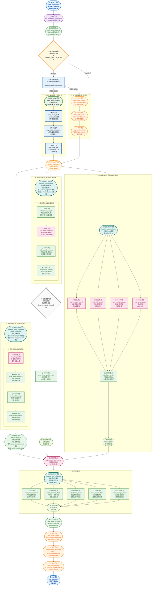

```mermaid
graph TD
    %% ========== 第一层：输入与解析 ==========
    START([📋 START节点<br/>start_optimized<br/>用户输入参数验证<br/>MCP开关检测])
    LLM([🤖 LLM节点<br/>llm_storyboard_generation<br/>GPT-4o分镜脚本生成])
    PARSE([💻 CODE节点<br/>code_script_parsing<br/>Python3脚本解析<br/>JSON结构化输出])
    
    %% ========== MCP集成层：智能路由与降级 ==========
    MCP_ROUTE{🔀 MCP路由决策<br/>⚡ 智能协议选择<br/>🔍 ENABLE_CAPCUT_MCP检测}
    MCP_HEALTH[🔧 MCP健康检查<br/>🌐 Bridge连通性测试<br/>📍 http://localhost:8082/health]
    
    %% MCP路径分支
    subgraph MCP_PATH ["🚀 MCP集成路径（优先） ⭐"]
        direction TB
        MCP_BRIDGE([🌉 MCP Bridge节点<br/>mcp_bridge_service<br/>🔗 端口: 8082<br/>⚡ 协议转换: HTTP-MCP])
        MCP_CREATE[🔧 MCP工具<br/>mcp_create_draft<br/>✨ create_draft工具<br/>🚀 草稿创建优化]
        MCP_BATCH[🔧 MCP工具<br/>mcp_batch_operations<br/>📦 批量素材添加<br/>⚡ 并发优化]
        MCP_SAVE[🔧 MCP工具<br/>mcp_save_draft<br/>💾 save_draft工具<br/>🚀 导出优化]
        
        MCP_BRIDGE --> MCP_CREATE
        MCP_CREATE --> MCP_BATCH
        MCP_BATCH --> MCP_SAVE
    end
    
    %% HTTP降级路径
    subgraph HTTP_FALLBACK ["🔄 HTTP降级路径（备用）"]
        direction TB
        HTTP_PROJECT([🌐 HTTP节点<br/>http_create_project<br/>POST /api/v1/projects<br/>传统项目创建])
        HTTP_ASSETS([🌐 HTTP节点<br/>http_add_assets<br/>POST /api/v1/timeline<br/>传统素材添加])
        HTTP_RENDER([🌐 HTTP节点<br/>http_render_video<br/>POST /api/v1/render<br/>传统渲染])
        
        HTTP_PROJECT --> HTTP_ASSETS
        HTTP_ASSETS --> HTTP_RENDER
    end
    
    %% ========== 第二层：智能并行处理 ==========
    PARALLEL([🔄 PARALLEL节点<br/>parallel_processing<br/>智能负载均衡<br/>动态资源分配])
    
    %% 音频处理分支（新增迭代优化）
    subgraph AUDIO_BRANCH ["🎵 音频处理分支（迭代优化版）"]
        direction TB
        AUDIO_ITER([🔄 ITERATION节点<br/>iteration_audio_segments<br/>音频片段并行处理<br/>最大并发数: 6<br/>输入: audio_segments数组<br/>输出: processed_segments数组])
        
        %% 迭代节点内部流程
        subgraph ITER_INTERNAL ["🔄 迭代节点内部处理流程"]
            direction TB
            TTS_MULTI[🔧 TOOL节点<br/>tool_tts_parallel<br/>多音色并行TTS<br/>支持批量合成]
            AUDIO_ENHANCE[💻 CODE节点<br/>code_audio_enhance<br/>并行音频降噪<br/>智能音量平衡]
            SUBTITLE_ALIGN[💻 CODE节点<br/>code_subtitle_align<br/>精确时间轴对齐<br/>毫秒级同步]
            AUDIO_FEATURES[💻 CODE节点<br/>code_audio_analysis<br/>音频特征提取<br/>节拍/情绪分析]
            
            TTS_MULTI --> AUDIO_ENHANCE
            AUDIO_ENHANCE --> SUBTITLE_ALIGN
            SUBTITLE_ALIGN --> AUDIO_FEATURES
        end
        
        AUDIO_ITER --> ITER_INTERNAL
    end
    
    %% 音频收敛节点（迭代节点外部）
    AUDIO_SYNC([💻 CODE节点<br/>code_audio_sync<br/>音频同步收敛<br/>时长基准确定<br/>输入: processed_segments数组<br/>输出: synchronized_audio])
    
    %% 视觉素材分支（优化迭代调度）
    subgraph VISUAL_BRANCH ["🎬 视觉素材分支（智能调度优化版）"]
        direction TB
        VISUAL_ITER([🔄 ITERATION节点<br/>iteration_visual_smart<br/>智能素材生成器<br/>最大并发数: 8<br/>输入: visual_segments数组<br/>输出: generated_visuals数组])
        
        %% 迭代节点内部流程
        subgraph VISUAL_ITER_INTERNAL ["🔄 迭代节点内部处理流程"]
            direction TB
            VISUAL_ANALYZE[💻 CODE节点<br/>code_visual_analyze<br/>单个素材需求分析<br/>类型判断与参数提取]
            VISUAL_GENERATE[🔧 TOOL节点<br/>tool_visual_generate<br/>单个视觉素材生成<br/>T2I/I2V/T2V智能选择]
            VISUAL_ENHANCE[💻 CODE节点<br/>code_visual_enhance<br/>单个素材质量优化<br/>分辨率/色彩调整]
            VISUAL_VALIDATE[💻 CODE节点<br/>code_visual_validate<br/>单个素材质量检查<br/>格式/尺寸验证]
            
            VISUAL_ANALYZE --> VISUAL_GENERATE
            VISUAL_GENERATE --> VISUAL_ENHANCE
            VISUAL_ENHANCE --> VISUAL_VALIDATE
        end
        
        VISUAL_ITER --> VISUAL_ITER_INTERNAL
    end
    
    %% 视觉素材收敛节点（迭代节点外部）
    VISUAL_SMART_ROUTE{🔀 智能路由收敛<br/>优先级调度<br/>资源感知分配<br/>输入: generated_visuals数组}
    VISUAL_QUALITY_CHECK[💻 CODE节点<br/>code_visual_quality_batch<br/>批量质量评分<br/>自动重生成机制]
    VISUAL_OUTPUT([📦 视觉素材输出<br/>标准化格式<br/>质量保证])
    
    %% BGM处理分支（新增多维度迭代）
    subgraph BGM_BRANCH ["🎵 BGM处理分支（多维度搜索版）"]
        direction TB
        BGM_ITER([🔄 ITERATION节点<br/>iteration_bgm_multidim<br/>多维度BGM搜索<br/>最大并发数: 4])
        KEYWORD_SEARCH[🔧 TOOL节点<br/>tool_keyword_search<br/>关键词语义匹配<br/>相似度算法]
        STYLE_SEARCH[🔧 TOOL节点<br/>tool_style_search<br/>风格标签匹配<br/>多风格并行]
        EMOTION_SEARCH[🔧 TOOL节点<br/>tool_emotion_search<br/>情绪分析匹配<br/>情感计算]
        BEAT_SEARCH[🔧 TOOL节点<br/>tool_beat_search<br/>节拍匹配<br/>BPM分析]
        BGM_SMART_RANK[💻 CODE节点<br/>code_bgm_ranking<br/>智能排序算法<br/>去重+多样性保证]
        BGM_OUTPUT([🎵 BGM输出<br/>综合评分排序<br/>多样性保证])
        
        BGM_ITER --> KEYWORD_SEARCH
        BGM_ITER --> STYLE_SEARCH
        BGM_ITER --> EMOTION_SEARCH
        BGM_ITER --> BEAT_SEARCH
        KEYWORD_SEARCH --> BGM_SMART_RANK
        STYLE_SEARCH --> BGM_SMART_RANK
        EMOTION_SEARCH --> BGM_SMART_RANK
        BEAT_SEARCH --> BGM_SMART_RANK
        BGM_SMART_RANK --> BGM_OUTPUT
    end
    
    %% ========== 第三层：并行校验与收敛 ==========
    subgraph VALIDATION_BRANCH ["✅ 并行校验分支"]
        direction TB
        VALIDATION_ITER([🔄 ITERATION节点<br/>iteration_pre_validation<br/>渲染前并行校验<br/>最大并发数: 5<br/>错误收集模式])
        MATERIAL_CHECK[💻 CODE节点<br/>code_material_check<br/>素材完整性校验<br/>文件可访问性]
        TIMELINE_CHECK[💻 CODE节点<br/>code_timeline_check<br/>时间轴一致性校验<br/>无空白段检测]
        FORMAT_CHECK[💻 CODE节点<br/>code_format_check<br/>格式兼容性校验<br/>编码分辨率验证]
        PARAM_CHECK[💻 CODE节点<br/>code_param_check<br/>渲染参数校验<br/>资源充足性检查]
        COPYRIGHT_CHECK[💻 CODE节点<br/>code_copyright_check<br/>版权合规校验<br/>使用权限验证]
        VALIDATION_OUTPUT([✅ 校验结果输出<br/>完整性报告<br/>错误收集])
        
        VALIDATION_ITER --> MATERIAL_CHECK
        VALIDATION_ITER --> TIMELINE_CHECK
        VALIDATION_ITER --> FORMAT_CHECK
        VALIDATION_ITER --> PARAM_CHECK
        VALIDATION_ITER --> COPYRIGHT_CHECK
        MATERIAL_CHECK --> VALIDATION_OUTPUT
        TIMELINE_CHECK --> VALIDATION_OUTPUT
        FORMAT_CHECK --> VALIDATION_OUTPUT
        PARAM_CHECK --> VALIDATION_OUTPUT
        COPYRIGHT_CHECK --> VALIDATION_OUTPUT
    end
    
    %% ========== 第四层：收敛与渲染 ==========
    CONVERGENCE([💻 CODE节点<br/>code_smart_convergence<br/>智能素材收敛<br/>完整性验证])
    AUDIO_STRATEGY([💻 CODE节点<br/>code_audio_strategy<br/>音频为主时钟策略<br/>智能时间轴对齐])
    BGM_MIX([🌐 HTTP节点<br/>http_smart_mixing<br/>POST /api/v1/audio/mix<br/>智能混音+Ducking])
    TIMELINE([🌐 HTTP节点<br/>http_timeline_assembly<br/>POST /api/v1/timeline/create<br/>时间轴智能装配])
    RENDER([🌐 HTTP节点<br/>http_submit_render<br/>POST /api/v1/render/submit<br/>提交渲染任务])
    END([📋 END节点<br/>end_optimized<br/>返回下载链接<br/>性能报告])
    
    %% ========== 主流程连接（MCP集成版） ==========
    START --> LLM
    LLM --> PARSE
    PARSE --> MCP_ROUTE
    
    %% MCP路由决策流程
    MCP_ROUTE -->|MCP启用| MCP_HEALTH
    MCP_ROUTE -->|MCP禁用| HTTP_FALLBACK
    MCP_HEALTH -->|健康检查通过| MCP_PATH
    MCP_HEALTH -->|健康检查失败| HTTP_FALLBACK
    
    %% 路径汇聚到并行处理
    MCP_SAVE --> PARALLEL
    HTTP_RENDER --> PARALLEL
    
    %% 并行分支连接
    PARALLEL --> AUDIO_BRANCH
    PARALLEL --> VISUAL_BRANCH
    PARALLEL --> BGM_BRANCH
    
    %% 音频分支内部连接
    AUDIO_BRANCH --> AUDIO_SYNC
    
    %% 视觉素材分支连接（迭代节点外部收敛）
    VISUAL_BRANCH --> VISUAL_SMART_ROUTE
    VISUAL_SMART_ROUTE --> VISUAL_QUALITY_CHECK
    VISUAL_QUALITY_CHECK --> VISUAL_OUTPUT
    
    %% 收敛流程
    AUDIO_SYNC --> CONVERGENCE
    VISUAL_OUTPUT --> CONVERGENCE
    BGM_OUTPUT --> CONVERGENCE
    
    %% 校验流程
    CONVERGENCE --> VALIDATION_BRANCH
    VALIDATION_OUTPUT --> AUDIO_STRATEGY
    
    %% 后续处理
    AUDIO_STRATEGY --> BGM_MIX
    BGM_MIX --> TIMELINE
    TIMELINE --> RENDER
    RENDER --> END
    
    %% ========== 样式定义 ==========
    classDef startEnd fill:#e3f2fd,stroke:#1976d2,stroke-width:3px,color:#0d47a1,font-weight:bold
    classDef llmNode fill:#f3e5f5,stroke:#7b1fa2,stroke-width:2px,color:#4a148c
    classDef codeNode fill:#e8f5e9,stroke:#388e3c,stroke-width:2px,color:#1b5e20
    classDef httpNode fill:#fff3e0,stroke:#f57c00,stroke-width:2px,color:#e65100
    classDef toolNode fill:#fce4ec,stroke:#c2185b,stroke-width:2px,color:#880e4f
    classDef iterNode fill:#e0f2f1,stroke:#00695c,stroke-width:3px,color:#004d40
    classDef parallelNode fill:#fff8e1,stroke:#ff8f00,stroke-width:3px,color:#e65100
    classDef convergenceNode fill:#fce4ec,stroke:#ad1457,stroke-width:3px,color:#880e4f
    classDef outputNode fill:#f1f8e9,stroke:#689f38,stroke-width:2px,color:#33691e
    classDef routeNode fill:#fafafa,stroke:#616161,stroke-width:2px,color:#212121
    classDef mcpNode fill:#e3f2fd,stroke:#0d47a1,stroke-width:3px,color:#000
    classDef mcpBridge fill:#e8f5e8,stroke:#2e7d32,stroke-width:3px,color:#000
    classDef mcpRoute fill:#fff8e1,stroke:#f57f17,stroke-width:2px,color:#000
    
    %% ========== 应用样式 ==========
    class START,END startEnd
    class LLM llmNode
    class PARSE,AUDIO_ENHANCE,SUBTITLE_ALIGN,AUDIO_FEATURES,AUDIO_SYNC,VISUAL_ANALYZE,VISUAL_ENHANCE,VISUAL_VALIDATE,VISUAL_QUALITY_CHECK,BGM_SMART_RANK,MATERIAL_CHECK,TIMELINE_CHECK,FORMAT_CHECK,PARAM_CHECK,COPYRIGHT_CHECK,AUDIO_STRATEGY codeNode
    class HTTP_PROJECT,HTTP_ASSETS,HTTP_RENDER,BGM_MIX,TIMELINE,RENDER httpNode
    class TTS_MULTI,VISUAL_GENERATE,KEYWORD_SEARCH,STYLE_SEARCH,EMOTION_SEARCH,BEAT_SEARCH toolNode
    class AUDIO_ITER,VISUAL_ITER,BGM_ITER,VALIDATION_ITER iterNode
    class PARALLEL parallelNode
    class CONVERGENCE convergenceNode
    class VISUAL_OUTPUT,BGM_OUTPUT,VALIDATION_OUTPUT outputNode
    class VISUAL_SMART_ROUTE routeNode
    class MCP_CREATE,MCP_BATCH,MCP_SAVE,MCP_HEALTH mcpNode
    class MCP_BRIDGE mcpBridge
    class MCP_ROUTE mcpRoute
```
