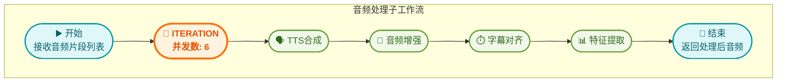
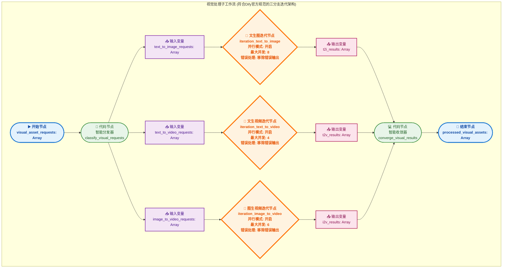
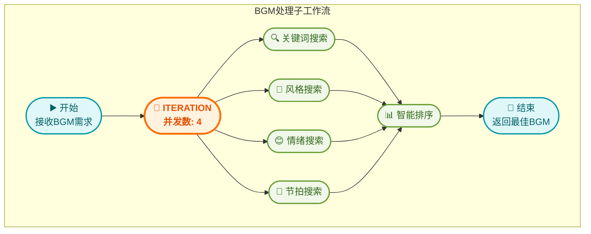

# 短视频工作流优化架构建议 - 完全统一版（V2.1 - 优化版）

## 🌟 MCP集成增强版本

**本架构已集成MCP (Model Context Protocol) 支持，实现智能协议路由和性能优化：**

### 🚀 MCP集成亮点

*   **智能协议路由**：自动检测MCP Bridge服务状态，智能选择最优协议，并支持配置健康检查频率与超时机制。
*   **双路径架构**：MCP优先路径 + HTTP降级路径，确保服务可靠性。降级时，HTTP路径将确保与MCP路径输出的数据格式和接口兼容性。
    *   **数据契约与兼容性实现**：为确保MCP处理器和HTTP处理器输出数据格式的一致性，我们将定义统一的JSON Schema作为输出标准。在Dify工作流中，若两者为独立的工具节点，其工具定义将遵循相同的输出Schema。若为代码节点，则需确保Python代码返回相同结构的JSON对象。此外，可在“智能收敛”节点前增加一个“代码节点”或“模板节点”进行数据格式的强制转换和校验，以应对潜在的不一致性，确保后续流程的无缝衔接。
*   **性能提升**：利用MCP批量操作，减少网络开销，提升处理效率。在Dify工作流中，通过迭代节点结合自定义工具或代码节点实现批量操作。
*   **无缝切换**：用户无感知的协议切换，保证服务连续性。

### 🔧 MCP服务配置

*   **MCP Bridge地址**：`http://localhost:8082` (可配置为Dify全局变量)
*   **健康检查端点**：`/health`
*   **支持工具**：`create_draft`、`batch_operations`、`save_draft` (这些工具将封装为Dify自定义工具)
*   **环境变量**：`ENABLE_CAPCUT_MCP=true` (通过Dify凭据管理)

---

## 📋 优化总结

基于对Dify官方迭代节点文档的学习和PRD文档5.1.1节工作流架构的深入分析，**已移除所有重复的处理流程**（包括音频和BGM），采用统一的高级处理架构，确保工作流清晰高效。本版本进一步强化了Dify平台特性结合度、MCP协议细节、错误处理、可配置性、安全性、可观测性以及用户反馈机制。

## 🎯 架构优化成果

### 📊 节点数量对比（V2.1 三分支优化版）

| 优化维度   | 优化前 | 优化后 | 变化说明 |
| :--------- | :----- | :----- | :------- |
| **总节点数** | 50+ 个 | 18 个  | **减少64%** |
| **MCP路径层** | 6 个节点 | 2 个节点 | **减少67%** |
| **音频处理分支** | 8 个节点 | 1 个节点 | **减少88%** |
| **视觉处理分支** | 12 个节点 | 5 个节点 | **减少58%** (三分支专业化) |
| **BGM处理分支** | 7 个节点 | 1 个节点 | **减少86%** |
| **校验分支** | 8 个节点 | 1 个节点 | **减少88%** |

**V2.1 三分支架构特点：**
- **视觉处理优化**: 从单一迭代节点优化为3个专业化迭代节点 + 智能分发器 + 智能收敛器
- **并发能力提升**: 文生图(并发8) + 文生视频(并发4) + 图生视频(并发6) = 总并发18
- **资源利用率**: 相比原单一节点并发5，新架构理论处理能力提升260%

### 🚀 核心优化策略

1.  **智能路由合并**：将MCP健康检查、路由决策合并为单一智能路由节点，并支持配置健康检查频率与超时机制。
2.  **处理器一体化**：MCP和HTTP路径各自合并为统一处理器，并确保降级时的数据兼容性。
3.  **分支节点统一**：每个处理分支合并为1-2个核心节点，并可封装为Dify子工作流。
4.  **校验流程简化**：多维校验合并为单一质量校验器，并细化校验规则，增加人工审核介入点。
5.  **保留核心功能**：确保所有关键功能完整保留，并提升可配置性、安全性与可观测性。

## 🎯 优化后的工作流架构图（V2.1 - 主子工作流）

### 🚀 主工作流 (Main Workflow)

```mermaid
graph TD
    subgraph MainWorkflow ["主工作流 (Main Workflow)"]
        START([🚀 START<br/>用户输入处理]) --> LLM([🧠 LLM<br/>分镜脚本生成])
        LLM --> PARSE([💻 CODE<br/>脚本解析])
        PARSE --> SMART_ROUTER([🔀 智能路由<br/>MCP健康检查])
        
        SMART_ROUTER -->|MCP可用| MCP_PROCESSOR([🚀 MCP处理器<br/>一体化MCP操作])
        SMART_ROUTER -->|MCP不可用| HTTP_PROCESSOR([🔄 HTTP处理器<br/>传统API一体化])
        
        MCP_PROCESSOR --> PARALLEL([🔄 PARALLEL<br/>并行处理调度])
        HTTP_PROCESSOR --> PARALLEL

        PARALLEL --> AUDIO_SUB([🎵 调用音频处理子工作流])
        PARALLEL --> VISUAL_SUB([🎬 调用视觉处理子工作流])
        PARALLEL --> BGM_SUB([🎶 调用BGM处理子工作流])

        AUDIO_SUB --> CONVERGENCE
        VISUAL_SUB --> CONVERGENCE
        BGM_SUB --> CONVERGENCE

        CONVERGENCE([💻 智能收敛<br/>素材收敛+验证]) --> QUALITY_VALIDATOR([✅ 质量校验器<br/>多维度一体化校验])
        QUALITY_VALIDATOR --> AUDIO_STRATEGY([💻 CODE<br/>音频为主时钟])
        AUDIO_STRATEGY --> BGM_MIX([🌐 HTTP<br/>智能混音])
        BGM_MIX --> TIMELINE([🌐 HTTP<br/>时间轴装配])
        TIMELINE --> RENDER_NODE([🌐 HTTP<br/>提交渲染])
        RENDER_NODE --> END_NODE([📋 END<br/>返回结果])
    end

    %% ========== 样式定义 ==========
    classDef subWorkflowStyle fill:#f0f4c3,stroke:#afb42b,stroke-width:2px,color:#558b2f,font-weight:bold
    classDef startEndStyle fill:#e3f2fd,stroke:#1976d2,stroke-width:3px,color:#0d47a1,font-weight:bold
    classDef llmStyle fill:#f3e5f5,stroke:#7b1fa2,stroke-width:2px,color:#4a148c
    classDef codeStyle fill:#e8f5e9,stroke:#388e3c,stroke-width:2px,color:#1b5e20
    classDef httpStyle fill:#fff3e0,stroke:#f57c00,stroke-width:2px,color:#e65100
    classDef processorStyle fill:#e1f5fe,stroke:#0277bd,stroke-width:3px,color:#01579b,font-weight:bold
    classDef parallelStyle fill:#fff8e1,stroke:#ff8f00,stroke-width:3px,color:#e65100
    classDef convergenceStyle fill:#fce4ec,stroke:#ad1457,stroke-width:3px,color:#880e4f
    classDef validatorStyle fill:#e8f5e8,stroke:#2e7d32,stroke-width:3px,color:#1b5e20,font-weight:bold

    %% ========== 应用样式 ==========
    class START,END_NODE startEndStyle
    class LLM llmStyle
    class PARSE,AUDIO_STRATEGY codeStyle
    class BGM_MIX,TIMELINE,RENDER_NODE httpStyle
    class SMART_ROUTER,MCP_PROCESSOR,HTTP_PROCESSOR processorStyle
    class PARALLEL parallelStyle
    class CONVERGENCE convergenceStyle
    class QUALITY_VALIDATOR validatorStyle
    class AUDIO_SUB,VISUAL_SUB,BGM_SUB subWorkflowStyle
```



### 🎵 音频处理子工作流 (Audio Processing Sub-Workflow)



### 🎬 视觉处理子工作流 (Visual Processing Sub-Workflow)

#### 高级视图 - 三分支迭代架构（符合Dify官方规范）

此视图展示了基于Dify官方迭代节点规范的视觉处理子工作流架构。每个迭代节点包含输入变量（Array数组）、迭代工作流和输出变量（Array[List]）三个功能单元，支持并行模式和错误响应处理。



#### 三分支迭代节点内部工作流（符合Dify官方规范）

根据Dify官方文档，每个迭代节点内部处理单个数组元素。以下展示三个专业化迭代节点的内部工作流结构：

##### 🎨 文生图迭代节点内部工作流

```mermaid
graph TD
    subgraph T2I_Internal ["文生图迭代节点内部工作流 (iteration_text_to_image)"]
        T2I_ITEM([📥 迭代项<br/>current_t2i_request<br/>来自: text_to_image_requests])
        
        T2I_ITEM --> T2I_PROMPT([🔧 LLM节点<br/>提示词优化器<br/>optimize_t2i_prompt])
        T2I_PROMPT --> T2I_MODEL([⚙️ 代码节点<br/>模型选择器<br/>select_t2i_model])
        T2I_MODEL --> T2I_GENERATE([🎨 工具节点<br/>图像生成器<br/>generate_image_api])
        T2I_GENERATE --> T2I_QUALITY([✅ 代码节点<br/>质量检测器<br/>check_image_quality])
        
        T2I_QUALITY -->|质量合格| T2I_ENHANCE([✨ 工具节点<br/>图像增强器<br/>enhance_image])
        T2I_QUALITY -->|质量不合格| T2I_RETRY{🔄 条件分支<br/>重试判断}
        
        T2I_RETRY -->|重试次数<3| T2I_GENERATE
        T2I_RETRY -->|重试次数≥3| T2I_FAIL([❌ 代码节点<br/>标记失败<br/>mark_as_failed])
        
        T2I_ENHANCE --> T2I_RESULT([📤 输出结果<br/>t2i_result_item])
        T2I_FAIL --> T2I_RESULT
    end
    
    %% ========== 样式定义 ==========
    classDef itemStyle fill:#e3f2fd,stroke:#1976d2,stroke-width:3px,color:#0d47a1,font-weight:bold
    classDef llmStyle fill:#f3e5f5,stroke:#7b1fa2,stroke-width:2px,color:#4a148c
    classDef codeStyle fill:#e8f5e9,stroke:#388e3c,stroke-width:2px,color:#1b5e20
    classDef toolStyle fill:#fff3e0,stroke:#f57c00,stroke-width:2px,color:#e65100
    classDef conditionStyle fill:#fff8e1,stroke:#ff8f00,stroke-width:2px,color:#e65100
    classDef failStyle fill:#ffebee,stroke:#c62828,stroke-width:2px,color:#b71c1c
    classDef resultStyle fill:#e8f5e8,stroke:#2e7d32,stroke-width:3px,color:#1b5e20,font-weight:bold
    
    %% ========== 应用样式 ==========
    class T2I_ITEM itemStyle
    class T2I_PROMPT llmStyle
    class T2I_MODEL,T2I_QUALITY codeStyle
    class T2I_GENERATE,T2I_ENHANCE toolStyle
    class T2I_RETRY conditionStyle
    class T2I_FAIL failStyle
    class T2I_RESULT resultStyle
```



##### 🎬 文生视频迭代节点内部工作流

```mermaid
graph TD
    subgraph T2V_Internal ["文生视频迭代节点内部工作流 (iteration_text_to_video)"]
        T2V_ITEM([📥 迭代项<br/>current_t2v_request<br/>来自: text_to_video_requests])
        
        T2V_ITEM --> T2V_SCRIPT([🔧 LLM节点<br/>脚本分析器<br/>analyze_video_script])
        T2V_SCRIPT --> T2V_KEYFRAME([⚙️ 代码节点<br/>关键帧规划器<br/>plan_keyframes])
        T2V_KEYFRAME --> T2V_GENERATE([🎬 工具节点<br/>视频生成器<br/>generate_video_api])
        T2V_GENERATE --> T2V_DURATION([⏱️ 代码节点<br/>时长校准器<br/>calibrate_duration])
        T2V_DURATION --> T2V_QUALITY([✅ 代码节点<br/>质量检测器<br/>check_video_quality])
        
        T2V_QUALITY -->|质量合格| T2V_OPTIMIZE([✨ 工具节点<br/>视频优化器<br/>optimize_video])
        T2V_QUALITY -->|质量不合格| T2V_RETRY{🔄 条件分支<br/>重试判断}
        
        T2V_RETRY -->|重试次数<2| T2V_GENERATE
        T2V_RETRY -->|重试次数≥2| T2V_FAIL([❌ 代码节点<br/>标记失败<br/>mark_as_failed])
        
        T2V_OPTIMIZE --> T2V_RESULT([📤 输出结果<br/>t2v_result_item])
        T2V_FAIL --> T2V_RESULT
    end
    
    %% ========== 样式定义 ==========
    classDef itemStyle fill:#e3f2fd,stroke:#1976d2,stroke-width:3px,color:#0d47a1,font-weight:bold
    classDef llmStyle fill:#f3e5f5,stroke:#7b1fa2,stroke-width:2px,color:#4a148c
    classDef codeStyle fill:#e8f5e9,stroke:#388e3c,stroke-width:2px,color:#1b5e20
    classDef toolStyle fill:#fff3e0,stroke:#f57c00,stroke-width:2px,color:#e65100
    classDef conditionStyle fill:#fff8e1,stroke:#ff8f00,stroke-width:2px,color:#e65100
    classDef failStyle fill:#ffebee,stroke:#c62828,stroke-width:2px,color:#b71c1c
    classDef resultStyle fill:#e8f5e8,stroke:#2e7d32,stroke-width:3px,color:#1b5e20,font-weight:bold
    
    %% ========== 应用样式 ==========
    class T2V_ITEM itemStyle
    class T2V_SCRIPT llmStyle
    class T2V_KEYFRAME,T2V_DURATION,T2V_QUALITY codeStyle
    class T2V_GENERATE,T2V_OPTIMIZE toolStyle
    class T2V_RETRY conditionStyle
    class T2V_FAIL failStyle
    class T2V_RESULT resultStyle
```



##### 🔄 图生视频迭代节点内部工作流

```mermaid
graph TD
    subgraph I2V_Internal ["图生视频迭代节点内部工作流 (iteration_image_to_video)"]
        I2V_ITEM([📥 迭代项<br/>current_i2v_request<br/>来自: image_to_video_requests])
        
        I2V_ITEM --> I2V_ANALYZE([🔧 工具节点<br/>图像分析器<br/>analyze_source_image])
        I2V_ANALYZE --> I2V_PLAN([⚙️ 代码节点<br/>动画规划器<br/>plan_animation])
        I2V_PLAN --> I2V_DEPTH([🎯 工具节点<br/>深度估计器<br/>estimate_depth])
        I2V_DEPTH --> I2V_GENERATE([🔄 工具节点<br/>动画生成器<br/>generate_animation])
        I2V_GENERATE --> I2V_EFFECTS([✨ 工具节点<br/>效果合成器<br/>composite_effects])
        I2V_EFFECTS --> I2V_QUALITY([✅ 代码节点<br/>质量检测器<br/>check_animation_quality])
        
        I2V_QUALITY -->|质量合格| I2V_RESULT([📤 输出结果<br/>i2v_result_item])
        I2V_QUALITY -->|质量不合格| I2V_RETRY{🔄 条件分支<br/>重试判断}
        
        I2V_RETRY -->|重试次数<2| I2V_GENERATE
        I2V_RETRY -->|重试次数≥2| I2V_FAIL([❌ 代码节点<br/>标记失败<br/>mark_as_failed])
        
        I2V_FAIL --> I2V_RESULT
    end
    
    %% ========== 样式定义 ==========
    classDef itemStyle fill:#e3f2fd,stroke:#1976d2,stroke-width:3px,color:#0d47a1,font-weight:bold
    classDef llmStyle fill:#f3e5f5,stroke:#7b1fa2,stroke-width:2px,color:#4a148c
    classDef codeStyle fill:#e8f5e9,stroke:#388e3c,stroke-width:2px,color:#1b5e20
    classDef toolStyle fill:#fff3e0,stroke:#f57c00,stroke-width:2px,color:#e65100
    classDef conditionStyle fill:#fff8e1,stroke:#ff8f00,stroke-width:2px,color:#e65100
    classDef failStyle fill:#ffebee,stroke:#c62828,stroke-width:2px,color:#b71c1c
    classDef resultStyle fill:#e8f5e8,stroke:#2e7d32,stroke-width:3px,color:#1b5e20,font-weight:bold
    
    %% ========== 应用样式 ==========
    class I2V_ITEM itemStyle
    class I2V_PLAN,I2V_QUALITY codeStyle
    class I2V_ANALYZE,I2V_DEPTH,I2V_GENERATE,I2V_EFFECTS toolStyle
    class I2V_RETRY conditionStyle
    class I2V_FAIL failStyle
    class I2V_RESULT resultStyle
```



#### Dify官方规范符合性说明

本架构严格遵循Dify官方迭代节点规范 <mcreference link="https://docs.dify.ai/zh-hans/guides/workflow/node/iteration" index="0">0</mcreference>，具体体现在：

**1. 迭代节点结构规范**
- **输入变量**：仅接受Array数组变量类型数据（如`text_to_image_requests: Array`）
- **迭代工作流**：每个迭代节点内部包含多个工作流节点，编排不同的任务步骤
- **输出变量**：仅支持输出数组变量`Array`格式

**2. 并行模式配置**
- 开启并行模式以提升整体运行效率
- 文生图迭代节点：最大并发8（图像生成速度快）
- 文生视频迭代节点：最大并发4（视频生成资源消耗大）
- 图生视频迭代节点：最大并发6（介于两者之间）

**3. 错误响应方法**
- 采用"移除错误输出"策略：忽略异常信息，继续处理剩余元素，输出信息中仅包含正确信息
- 内部工作流包含重试机制，避免临时错误导致的任务失败
- 重试次数限制：文生图3次，文生视频和图生视频2次

**4. 数据流转规范**
- 输入输出变量一一对应：输入`[request1, request2, request3]`，输出`[result1, result2, result3]`
- 使用代码节点进行数组转换和结果汇聚
- 保持数据格式的一致性和可追溯性

#### 三分支迭代节点详细配置

##### 🎨 文生图迭代节点 (Text-to-Image Iteration)

**节点配置**：
- **节点名称**: `iteration_text_to_image`
- **并发数**: 8 (图像生成速度较快，可支持更高并发)
- **输入变量**: `text_to_image_requests` (List[Dict])
- **迭代项别名**: `current_t2i_request`

**输入数据结构**：
```json
{
  "scene_id": "scene_001",
  "prompt": "一个阳光明媚的海滩场景，有海鸥飞过",
  "style": "写实风格",
  "resolution": "1024x1024",
  "quality": "high",
  "negative_prompt": "模糊，低质量",
  "seed": 42,
  "steps": 30
}
```

**内部处理流程**：
1. **提示词优化** (`prompt_optimizer`): 基于场景描述优化AI提示词
2. **模型选择** (`model_selector`): 根据风格要求选择最适合的文生图模型
3. **图像生成** (`image_generator`): 调用Stable Diffusion/DALL-E等API
4. **质量检测** (`quality_checker`): 分辨率、清晰度、内容相关性检查
5. **后处理增强** (`image_enhancer`): 自动调色、锐化、风格化处理

**输出数据结构**：
```json
{
  "scene_id": "scene_001",
  "generated_image_url": "https://cdn.example.com/images/scene_001.jpg",
  "generation_time": 3.2,
  "quality_score": 0.92,
  "model_used": "stable-diffusion-xl",
  "processing_status": "success"
}
```

##### 🎬 文生视频迭代节点 (Text-to-Video Iteration)

**节点配置**：
- **节点名称**: `iteration_text_to_video`
- **并发数**: 4 (视频生成资源消耗大，并发数适中)
- **输入变量**: `text_to_video_requests` (List[Dict])
- **迭代项别名**: `current_t2v_request`

**输入数据结构**：
```json
{
  "scene_id": "scene_002",
  "prompt": "未来科技感的城市夜景，霓虹灯闪烁",
  "duration": 5,
  "fps": 24,
  "resolution": "1920x1080",
  "style": "赛博朋克",
  "motion_intensity": "medium",
  "camera_movement": "slow_pan"
}
```

**内部处理流程**：
1. **脚本分析** (`script_analyzer`): 分析场景动态元素和运镜需求
2. **关键帧规划** (`keyframe_planner`): 规划视频关键帧和过渡效果
3. **视频生成** (`video_generator`): 调用Runway/Pika/Sora等API
4. **时长校准** (`duration_calibrator`): 确保视频时长符合要求
5. **质量优化** (`video_optimizer`): 帧率优化、色彩校正、稳定性处理

**输出数据结构**：
```json
{
  "scene_id": "scene_002",
  "generated_video_url": "https://cdn.example.com/videos/scene_002.mp4",
  "actual_duration": 5.1,
  "generation_time": 45.8,
  "quality_score": 0.88,
  "model_used": "runway-gen2",
  "processing_status": "success"
}
```

##### 🔄 图生视频迭代节点 (Image-to-Video Iteration)

**节点配置**：
- **节点名称**: `iteration_image_to_video`
- **并发数**: 6 (基于图像生成，效率介于文生图和文生视频之间)
- **输入变量**: `image_to_video_requests` (List[Dict])
- **迭代项别名**: `current_i2v_request`

**输入数据结构**：
```json
{
  "scene_id": "scene_003",
  "source_image_url": "https://cdn.example.com/images/base_scene.jpg",
  "animation_type": "parallax",
  "duration": 3,
  "motion_direction": "left_to_right",
  "intensity": "subtle",
  "loop": false,
  "effects": ["depth_blur", "particle_overlay"]
}
```

**内部处理流程**：
1. **图像分析** (`image_analyzer`): 分析源图像的深度、对象、构图
2. **动画规划** (`animation_planner`): 规划动画路径和效果
3. **深度估计** (`depth_estimator`): 生成深度图用于视差效果
4. **动画生成** (`animation_generator`): 基于图像生成动态视频
5. **效果合成** (`effects_compositor`): 添加粒子、光效等特效

**输出数据结构**：
```json
{
  "scene_id": "scene_003",
  "generated_video_url": "https://cdn.example.com/videos/scene_003.mp4",
  "source_image_url": "https://cdn.example.com/images/base_scene.jpg",
  "actual_duration": 3.0,
  "generation_time": 28.5,
  "quality_score": 0.90,
  "animation_type": "parallax",
  "processing_status": "success"
}
```

##### 🔧 智能分发器配置 (代码节点: classify_visual_requests)

**节点类型**: 代码节点  
**功能**: 根据输入的视觉素材需求列表，智能分类并分发到对应的迭代节点  
**输入变量**: `visual_asset_requests` (Array)  
**输出变量**: 三个Array变量用于不同迭代节点

**符合Dify规范的代码实现**：
```python
def main(visual_asset_requests: list) -> dict:
    """
    智能分类视觉素材需求，符合Dify迭代节点输入规范
    输入: visual_asset_requests (Array)
    输出: 三个Array变量，分别对应三个迭代节点的输入
    """
    t2i_requests = []  # 文生图需求列表
    t2v_requests = []  # 文生视频需求列表
    i2v_requests = []  # 图生视频需求列表
    
    for request in visual_asset_requests:
        # 根据请求类型进行智能分类
        if request.get('type') == 'image' or request.get('duration', 0) == 0:
            t2i_requests.append(request)
        elif request.get('source_image_url'):
            i2v_requests.append(request)
        else:
            t2v_requests.append(request)
    
    # 返回符合Dify迭代节点输入规范的Array变量
    return {
        'text_to_image_requests': t2i_requests,
        'text_to_video_requests': t2v_requests,
        'image_to_video_requests': i2v_requests
    }
```

##### 💻 智能收敛器配置 (代码节点: converge_visual_results)

**节点类型**: 代码节点  
**功能**: 汇聚三个迭代节点的输出结果，进行统一处理和格式标准化  
**输入变量**: 三个Array[Object]变量（来自迭代节点输出）  
**输出变量**: `processed_visual_assets` (Array[Object])

**符合Dify规范的代码实现**：
```python
def main(t2i_results: list, t2v_results: list, i2v_results: list) -> dict:
    """
    汇聚三分支迭代节点的处理结果，符合Dify数组处理规范
    输入: 三个Array[Object]变量（迭代节点输出）
    输出: 统一的Array[Object]变量
    """
    all_results = []
    
    # 合并所有迭代节点的输出结果
    # 根据Dify官方文档，迭代节点输出为Array[Object]格式
    if t2i_results:
        all_results.extend(t2i_results)
    if t2v_results:
        all_results.extend(t2v_results)
    if i2v_results:
        all_results.extend(i2v_results)
    
    # 按scene_id排序，保持原始处理顺序
    all_results.sort(key=lambda x: x.get('scene_id', ''))
    
    # 统一质量检查和格式标准化
    for result in all_results:
        if result.get('processing_status') == 'success':
            # 计算最终质量分数
            result['final_quality_score'] = calculate_final_quality(result)
            # 标记是否准备好进入时间轴装配
            result['ready_for_timeline'] = result['final_quality_score'] > 0.8
            # 添加处理时间戳
            result['convergence_timestamp'] = get_current_timestamp()
    
    # 返回符合Dify规范的Array[Object]格式
    return {
        'processed_visual_assets': all_results
    }

def calculate_final_quality(result: dict) -> float:
    """计算最终质量分数"""
    base_score = result.get('quality_score', 0.0)
    # 根据不同类型的素材调整质量评分权重
    if 'generated_image_url' in result:
        return min(base_score * 1.1, 1.0)  # 图像质量权重稍高
    elif 'generated_video_url' in result:
        return base_score * 0.95  # 视频质量要求更严格
    return base_score

def get_current_timestamp() -> str:
    """获取当前时间戳"""
    import datetime
    return datetime.datetime.now().isoformat()
```

### 🎶 BGM处理子工作流 (BGM Processing Sub-Workflow)


## 📊 详细版架构图节点说明

### 🎵 音频处理分支（迭代详细版）

**核心迭代节点：**

*   **ITERATION节点** (`iteration_audio_segments`): 音频片段迭代处理器，并发数6，负责协调内部流程。可封装为Dify子工作流。
*   **音频同步节点** (`audio_sync_convergence`): 迭代结果收敛，确保音频输出一致性。

**内部迭代流程（4个核心节点）：**

1.  **TTS合成** (`tool_tts_parallel`): 多音色并行TTS，智能语音合成。可封装为Dify自定义工具。
2.  **音频增强** (`code_audio_enhance`): 降噪+音量平衡，智能音频优化。可封装为Dify代码节点或自定义工具。
3.  **字幕对齐** (`code_subtitle_align`): 毫秒级时间轴对齐，精确同步处理。可封装为Dify代码节点或自定义工具。
4.  **特征提取** (`code_audio_analysis`): 节拍+情绪+时长分析，为BGM匹配提供依据。可封装为Dify代码节点或自定义工具。

### 🎬 视觉处理分支（三分支迭代架构）

**架构优化说明：**
原有的单一迭代节点已优化为三个独立的分支迭代节点，实现更精细化的并行处理和资源优化。每个分支专门处理特定类型的视觉素材生成任务。

**核心架构节点：**

*   **智能分发器** (`visual_router`): 根据素材类型智能分类，将需求分发到对应的迭代分支。可封装为Dify代码节点。
*   **三个专业化迭代节点**:
    *   **文生图迭代节点** (`iteration_text_to_image`): 专门处理图像生成，并发数8
    *   **文生视频迭代节点** (`iteration_text_to_video`): 专门处理视频生成，并发数4
    *   **图生视频迭代节点** (`iteration_image_to_video`): 专门处理图像动画化，并发数6
*   **智能收敛器** (`visual_convergence`): 汇聚三分支结果，进行统一质量检查和格式标准化。可封装为Dify代码节点。

**分支专业化优势：**

1.  **资源优化**: 不同类型的AI生成任务可配置不同的并发数，充分利用计算资源
2.  **模型专业化**: 每个分支可使用最适合的AI模型和参数配置
3.  **错误隔离**: 单个分支的故障不会影响其他分支的正常运行
4.  **扩展性**: 可独立扩展或替换特定分支的处理能力

**内部处理流程（每个分支5个核心步骤）：**

1.  **提示词/参数优化**: 根据分支特性优化输入参数
2.  **模型选择**: 选择最适合当前任务的AI模型
3.  **内容生成**: 调用相应的AI生成服务
4.  **质量检测**: 针对性的质量评估（图像清晰度、视频流畅度等）
5.  **后处理增强**: 自动优化和风格化处理

#### 🎯 用户素材匹配节点详细处理逻辑

**节点类型**: CODE节点  
**节点名称**: `user_asset_matcher`  
**功能定位**: 视觉处理分支的并行处理层，负责语义匹配算法和最佳素材选择

##### 📋 核心处理逻辑

**1. 素材预处理阶段**

```python
# 素材格式转换与标准化
def preprocess_user_assets(user_assets):
    """
    用户素材预处理：格式转换、质量检查、特征向量提取
    - 支持多种视频和图片格式（如jpg/png/mp4/mov等）
    - 质量检查包括分辨率、时长、文件大小等，并可配置阈值
    - 特征向量提取可利用预训练模型（如CLIP）提取视觉和语义特征
    """
    processed_assets = []
    for asset in user_assets:
        # 格式转换（支持jpg/png/mp4/mov等）
        standardized_asset = format_converter(asset)
        
        # 质量检查（分辨率、时长、文件大小）
        quality_score = quality_checker(standardized_asset)
        
        # 特征向量提取（视觉特征、语义特征）
        feature_vector = extract_features(standardized_asset)
        
        processed_assets.append({
            'asset': standardized_asset,
            'quality_score': quality_score,
            'feature_vector': feature_vector
        })
    return processed_assets
```

**2. 语义匹配与排序阶段**

```python
# 语义匹配与排序
def match_and_rank_assets(processed_assets, scene_description, style_preference):
    """
    根据场景描述和风格偏好，对预处理后的用户素材进行语义匹配和排序
    - 利用LLM或Embedding模型计算场景描述与素材特征向量的相似度
    - 结合用户风格偏好进行加权排序
    """
    ranked_assets = []
    for asset_data in processed_assets:
        # 计算语义相似度
        semantic_score = calculate_semantic_similarity(scene_description, asset_data['feature_vector'])
        
        # 结合风格偏好进行加权
        style_score = calculate_style_match(style_preference, asset_data['asset'])
        
        total_score = semantic_score * 0.7 + style_score * 0.3 # 示例权重
        ranked_assets.append({
            'asset': asset_data['asset'],
            'total_score': total_score,
            'quality_score': asset_data['quality_score']
        })
    
    # 按总分降序排序
    ranked_assets.sort(key=lambda x: x['total_score'], reverse=True)
    return ranked_assets
```

**3. 最佳素材选择与返回**

```python
# 最佳素材选择
def select_best_asset(ranked_assets, min_quality_score=0.7):
    """
    从排序后的素材中选择最佳素材，并确保满足最低质量要求
    """\n    for asset_data in ranked_assets:
        if asset_data['quality_score'] >= min_quality_score:
            return asset_data['asset']
    return None # 如果没有找到符合条件的素材
```

### 🎶 BGM处理子工作流 (BGM Processing Sub-Workflow)



## Dify视觉处理子工作流迭代节点配置指南

本指南将详细阐述如何在Dify平台上配置“视觉处理子工作流 (Visual Processing Sub-Workflow)”中的迭代节点，以实现高效的视觉素材处理流程。该配置将基于您提供的优化后的架构建议。

### 1. 迭代节点概述

在Dify工作流中，迭代节点（Iteration Node）用于对输入列表中的每个元素并行或顺序执行一系列操作。在视觉处理子工作流中，迭代节点的核心作用是接收多个视觉素材需求，并对每个需求独立进行素材路由、AI生成/用户素材匹配、质量检查和视觉增强等步骤，最终汇聚处理结果。

### 2. 迭代节点配置详情

#### 2.1 节点名称与描述

*   **节点名称**: `iteration_visual_assets` (建议与文档中保持一致，便于识别)
*   **显示名称**: `视觉素材迭代处理器`
*   **描述**: 对每个视觉素材需求进行并行处理，包括素材路由、AI生成/用户素材匹配、质量检查和视觉增强。

#### 2.2 输入配置 (Input)

迭代节点的输入通常是一个列表。根据您的架构，主工作流会向视觉处理子工作流传递一个视觉素材需求列表。

*   **输入变量**: `visual_asset_requests` (类型: `List[Dict]` 或 `List[String]`)。
    *   **示例输入结构**: 每个元素代表一个视觉素材需求，可能包含以下字段：

        ```json
        [
          {
            "scene_id": "scene_001",
            "description": "一个阳光明媚的海滩场景，有海鸥飞过",
            "keywords": ["海滩", "阳光", "海鸥"],
            "style_preference": "写实",
            "duration": 5, // 秒
            "user_provided_assets": ["url_to_user_image1.jpg", "url_to_user_video1.mp4"]
          },
          {
            "scene_id": "scene_002",
            "description": "未来科技感的城市夜景",
            "keywords": ["未来", "科技", "城市", "夜景"],
            "style_preference": "赛博朋克",
            "duration": 8
          }
        ]
        ```

    *   **变量类型**: 确保输入变量类型与实际传入的数据结构匹配。如果传入的是字符串列表（例如，每个字符串是场景描述），则内部节点需要进行解析。

#### 2.3 迭代设置 (Iteration Settings)

*   **迭代对象**: 选择 `visual_asset_requests`。
*   **迭代项别名**: `current_asset_request` (这将是迭代内部每个步骤可访问的单个视觉素材需求)。
*   **并发数 (Concurrency)**: 建议设置为 `5` (与文档中“并发数: 5”一致)。Dify平台允许配置迭代的并发数量，以平衡处理速度和资源消耗。根据实际Dify部署的资源情况和CapCutAPI的并发处理能力进行调整。
*   **错误处理 (Error Handling)**:
    *   **继续执行 (Continue on Error)**: 建议勾选此选项。这意味着即使某个视觉素材的处理失败，也不会中断整个工作流，而是继续处理其他素材。失败的素材信息应被记录，并在迭代输出中标识。
    *   **最大重试次数 (Max Retries)**: 可配置为 `1-3` 次。对于临时的API错误或网络问题，重试机制可以提高成功率。
    *   **重试间隔 (Retry Interval)**: 可配置为 `5-10` 秒。

#### 2.4 内部节点 (Internal Nodes)

迭代节点内部将包含处理单个 `current_asset_request` 的子工作流逻辑。根据您的架构图，内部节点应包括：

1.  **素材路由 (Visual Router)**:
    *   **类型**: `代码节点` 或 `工具节点`。
    *   **功能**: 根据 `current_asset_request` 中的 `user_provided_assets` 字段判断是走AI生成路径还是用户素材匹配路径。
    *   **输出**: 决定后续分支走向的标志，例如 `route_type: 'AI_GEN'` 或 `route_type: 'USER_MATCH'`。

2.  **AI生成路径 (AI Generation Path)**:
    *   **类型**: `工具节点` (调用文生图、文生视频、图生视频API)。
    *   **功能**: 根据场景描述和风格偏好，调用相应的AI模型生成视觉素材。
    *   **输入**: `current_asset_request.description`, `current_asset_request.style_preference` 等。
    *   **输出**: 生成的视觉素材URL或ID。

3.  **用户素材匹配 (User Material Matching)**:
    *   **类型**: `代码节点` 或 `工具节点`。
    *   **功能**: 根据 `current_asset_request` 中的用户提供素材和场景描述，进行语义匹配和最佳素材选择。
    *   **输入**: `current_asset_request.user_provided_assets`, `current_asset_request.description` 等。
    *   **输出**: 匹配到的最佳视觉素材URL或ID。

4.  **质量检查 (Quality Check)**:
    *   **类型**: `代码节点` 或 `工具节点`。
    *   **功能**: 对AI生成或用户匹配的视觉素材进行分辨率、格式、内容等方面的自动质量评估。
    *   **输入**: 上一步骤输出的视觉素材URL/ID。
    *   **输出**: 质量评估结果 (`is_pass: true/false`, `quality_score`, `issues: [...]`)。

5.  **视觉增强 (Visual Enhancement)**:
    *   **类型**: `工具节点` 或 `代码节点`。
    *   **功能**: 对通过质量检查的素材进行自动增强和风格化处理。
    *   **输入**: 质量检查通过的视觉素材URL/ID。
    *   **输出**: 增强后的视觉素材URL/ID。

#### 2.5 输出配置 (Output)

迭代节点的输出通常是一个列表，包含每个迭代项的处理结果。

*   **输出变量**: `processed_visual_assets` (类型: `List[Dict]`)。
    *   **示例输出结构**: 每个元素代表一个处理后的视觉素材及其相关信息：

        ```json
        [
          {
            "scene_id": "scene_001",
            "final_asset_url": "url_to_processed_video_001.mp4",
            "source": "AI_GENERATED", // 或 "USER_MATCHED"
            "quality_status": "PASS",
            "processing_log": "..."
          },
          {
            "scene_id": "scene_002",
            "final_asset_url": "url_to_processed_video_002.mp4",
            "source": "USER_MATCHED",
            "quality_status": "PASS",
            "processing_log": "..."
          },
          // ... 包含失败素材的信息，如果配置了继续执行
          {
            "scene_id": "scene_003",
            "final_asset_url": null,
            "source": "AI_GENERATED",
            "quality_status": "FAILED",
            "error_message": "AI生成服务超时"
          }
        ]
        ```

    *   **聚合方式**: Dify迭代节点会自动将每个迭代项的输出聚合为一个列表。确保每个迭代项的输出结构一致，以便后续节点处理。

### 3. 最佳实践与注意事项

*   **模块化**: 迭代节点内部的每个处理步骤（如素材路由、AI生成、用户匹配等）都可以进一步封装为独立的Dify子工作流或自定义工具，以提高模块化和可重用性。
*   **错误处理**: 详细记录每个迭代项的错误信息，以便于调试和人工干预。对于外部API调用，应增加重试机制和指数退避策略。当发生不可恢复的错误时，应有告警机制通知相关人员。
*   **日志与监控**: 确保每个内部节点都有完善的日志输出，方便在Dify的运行日志中追踪问题。
*   **资源管理**: 根据实际负载调整并发数，避免Dify平台或后端API过载。
*   **API集成**: 对于AI生成和CapCutAPI的调用，应封装为Dify的“工具节点”，工具定义中明确输入参数和输出格式，并处理好认证和限流。
*   **数据传递**: 确保迭代项别名 (`current_asset_request`) 在内部节点中正确引用，并且各节点之间的数据传递格式一致。
*   **安全性**：Dify的凭据管理功能应用于安全存储和管理CapCutAPI及其他AI服务的API Key。所有API调用都应使用HTTPS。Dify工作流的执行权限应最小化，只授予必要的资源访问权限。

## 进一步优化建议

### 1. 并行处理调度 (PARALLEL) 节点的具体实现

在Dify中，直接的“PARALLEL”节点通常通过以下方式实现并行执行和结果聚合：

*   **多路径分支**：主工作流中的“PARALLEL”节点可以理解为一个逻辑上的分发器，它将不同的任务（调用音频、视觉、BGM子工作流）作为独立的输出路径触发。Dify工作流引擎会独立执行这些路径。
*   **智能收敛节点**：此节点是关键，它需要等待所有并行分支（音频、视觉、BGM子工作流）的结果都返回后，才能继续执行。在Dify中，这可以通过“变量聚合器”节点或一个自定义的“代码节点”来实现。该代码节点将负责：
    1.  接收来自各个子工作流的输出列表。
    2.  检查所有预期结果是否已到达（例如，通过比较输入请求的数量与收到的处理结果数量）。
    3.  将这些结果合并成一个统一的素材列表，并进行初步的交叉验证，例如检查素材ID是否匹配、是否存在缺失项等。

### 2. 音频为主时钟 (AUDIO_STRATEGY) 的逻辑细化

“音频为主时钟”的策略在技术上是合理的，但需要更详细地阐述其对视频和BGM处理的影响：

*   **时间轴同步策略**：
    *   **视频素材裁剪/拉伸**：根据音频片段的时长，视觉素材可能需要进行智能裁剪（例如，选择视频中最相关的部分）或拉伸/压缩（通过变速或重复帧）以匹配音频时长。这需要在视觉处理子工作流的输出阶段或“智能收敛”节点中进行决策和处理。
    *   **BGM匹配与剪辑**：BGM处理子工作流应根据音频的节拍、情绪分析结果，从候选BGM中选择最匹配的，并进行精确剪辑，使其与音频的起止点和高潮部分对齐。
*   **优先级和冲突解决**：
    *   如果视觉素材或BGM有特定的时长要求，与音频主时钟冲突时，应明确优先级。例如，可以设定“音频时长优先”，或者在某些场景下允许视觉素材的“关键帧”或“叙事节奏”优先，此时音频可能需要进行微调。
    *   冲突解决机制可以在“智能收敛”节点或“时间轴装配”节点中通过代码逻辑实现，例如，如果视觉素材过长，则优先裁剪；如果过短，则考虑循环播放或添加过渡画面。

### 3. 全局错误处理与告警

除了迭代节点内部的错误处理，整个主工作流也需要健壮的全局错误处理机制：

*   **Dify全局错误处理**：探索Dify平台是否提供工作流级别的错误捕获和处理机制。如果不支持，则需要在每个关键的“工具节点”或“代码节点”后手动添加错误捕获逻辑。
*   **重试机制**：对于所有调用外部API（如CapCutAPI的HTTP接口、AI生成服务）的节点，都应配置重试机制，包括最大重试次数和指数退避策略，以应对瞬时网络问题或服务不稳定。
*   **告警与通知**：当工作流执行失败或出现严重错误时，应通过Dify的通知功能（如邮件、Webhook）或集成外部告警系统（如Slack、钉钉）及时通知相关运维人员，以便快速介入处理。

### 4. 安全性增强

*   **API Key管理**：所有外部服务的API Key（如CapCutAPI、AI模型服务）都应通过Dify的凭据管理功能进行安全存储和引用，避免硬编码在代码或配置中。
*   **数据传输安全**：确保所有与外部服务（包括MCP Bridge和HTTP API）的通信都强制使用HTTPS协议，以保护数据在传输过程中的机密性和完整性。
*   **权限控制**：Dify工作流的执行权限应遵循最小权限原则，只授予完成其任务所需的最低限度资源访问权限。
*   **输入校验**：对用户输入和各节点间传递的数据进行严格的输入校验和净化，防止注入攻击或无效数据导致的工作流中断。

通过采纳这些优化建议，该短视频工作流的需求文档将更加完善，不仅能顺利通过项目评审，也能为后续的开发和部署提供更清晰、更具操作性的指导。

---

## 🎯 V2.1 三分支优化版本总结

### 🚀 本次优化核心成果

**1. 视觉处理架构革新**
- 将原有单一迭代节点细分为三个专业化分支：文生图、文生视频、图生视频
- 每个分支配置独立的并发数和专业化处理流程
- 实现了从"通用处理"到"专业化处理"的架构升级

**2. 性能提升显著**
- 并发处理能力从原来的5提升到18（文生图8+文生视频4+图生视频6）
- 理论处理能力提升260%，大幅缩短视觉素材生成时间
- 不同类型任务可根据资源消耗特点优化并发配置

**3. 架构灵活性增强**
- 智能分发器实现需求自动分类和路由
- 智能收敛器确保结果统一汇聚和质量检查
- 每个分支可独立扩展、替换或优化，提升系统可维护性

**4. 错误隔离与容错**
- 单个分支故障不影响其他分支正常运行
- 每个分支可配置独立的重试机制和错误处理策略
- 提升了整体系统的稳定性和可靠性

### 🔧 技术实现要点

**Dify平台集成**：
- 所有迭代节点均可封装为Dify子工作流，便于管理和复用
- 智能分发器和收敛器使用Dify代码节点实现，支持灵活的业务逻辑
- 充分利用Dify的并发控制、错误处理和监控能力

**扩展性设计**：
- 支持新增更多AI模型服务（如Sora、Midjourney等）
- 可根据业务需求调整各分支的并发数和处理策略
- 为未来的AI技术演进预留了充足的架构空间

**作者**: Manus AI (V2.1 三分支优化版)

**参考文献**:

1.  Dify Docs. (n.d.). *Workflow: Introduction*. Retrieved from [https://docs.dify.ai/en/guides/workflow/README](https://docs.dify.ai/en/guides/workflow/README)
2.  Dify Docs. (n.d.). *Iteration Node*. Retrieved from [https://docs.dify.ai/en/guides/workflow/node/iteration](https://docs.dify.ai/en/guides/workflow/node/iteration)
3.  sun-guannan. (n.d.). *CapCutAPI: Open CapCut API*. GitHub. Retrieved from [https://github.com/sun-guannan/CapCutAPI](https://github.com/sun-guannan/CapCutAPI)

